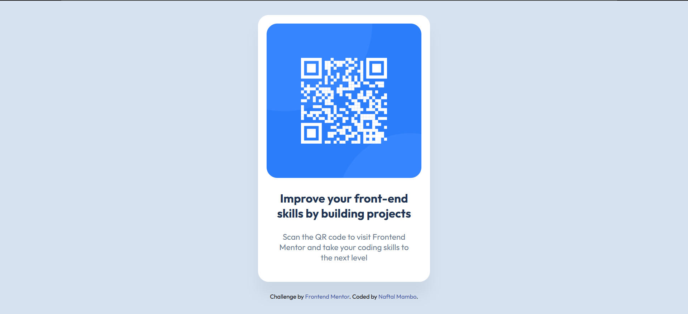
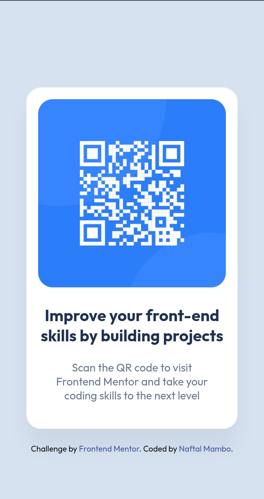

# Frontend Mentor - QR code component solution

This is my solution to the [QR code component challenge on Frontend Mentor](https://frontendmentor.io)

## Table of contents

- [Overview](#overview)
  - [The challenge](#the-challenge)
  - [Screenshot](#screenshot)
  - [Links](#links)
- [My process](#my-process)
  - [Built with](#built-with)
  - [What I learned](#what-i-learned)
  - [Continued development](#continued-development)
  - [AI Collaboration](#ai-collaboration)
- [Open for Opportunities & Collaboration](#open-for-opportunities--collaboration)
- [Acknowledgments](#acknowledgments)

## Overview

### The challenge

A simple component to practice layout skills using HTML and CSS.

### Screenshot

| Desktop Version                                   | Mobile Version                                  |
| :------------------------------------------------ | :---------------------------------------------- |
|  |  |

### Links

- Solution URL: [GitHub Repository](https://github.com/naftalmambo/qr-code-component)
- Live Site URL: [Live Demo](https://naftalmambo.github.io/qr-code-component/)

## My process

### Built with

- **Semantic HTML5 markup**
- **CSS custom properties**
- **Flexbox**
- **Mobile-first workflow**
- **Google Fonts (Outfit)**
- **VS Code** - My primary editor for writing clean, structured code.
- **Linux (Ubuntu/WSL)** - My development environment for a professional, stable workflow.
- **Windows Browser (Chrome)** - Used for cross-browser testing to ensure its responsive.

### What I learned

I practiced centering elements using `min-height: 100vh` and `flexbox` on the body. I also learned how to use a **GitHub Personal Access Token (PAT)** to push my code securely from the terminal.

```bash
# How I saved my Git token to avoid re-typing it:
git config --global credential.helper store
```

This kind of work is teaching me how to make a page accessible and responsive even without using @media queries.

### Continued development

In future work, I intend to focus on:

- **Responsiveness:** I believe I've tried my best to make this project be solid in different screen sizes by being flexible with the heights and widths.

### AI Collaboration

- This project used AI on Google Search as a coding collaborator.

- **Git Authentication:** The AI helped with understanding how to use a **Personal Access Token (PAT)** for secure Git pushes after encountering Git authentication issues. Thus my workflow got streamlined.

## Open for Opportunities & Collaboration

This project marks the beginning of my journey toward becoming a professional Web Developer and ultimately a Java Full-Stack. I am currently:

- 🔭 **Open for work:** Looking for junior roles or freelance opportunities where I can apply my skills in HTML, CSS, and Javascript(in-progress).
- 🤝 **Open to contribute:** Interested in collaborating on open-source projects or team-based challenges.

If you like what you see or have a project you need help with, connect with:

**Author**

- Frontend Mentor - [@naftalmambo](https://frontendmentor.io)
- LinkedIn - [Naftal Mambo](https://linkedin.com/in/naftalmambo)
- GitHub - [@naftalmambo](https://github.com/naftalmambo)
- Discord - [devMambo](https://discordapp.com/users/1157321092482994246)

## Acknowledgments

### 🌟 Appreciation for Frontend Mentor

I want to express my sincere gratitude to **[Frontend Mentor](https://www.frontendmentor.io)** for providing these incredible, real-world challenges that I am sure will enable me to grow to be the man I aspire to be.

This platform will be more than just a place to practice, it will be a gateway to building skills that truly **change lives**.

By bridging the gap between theory and professional workflows, Frontend Mentor will help me build a rock-solid skill for a future where I can create meaningful digital solutions.

## Credits

While this is a [Frontend Mentor](https://www.frontendmentor.io) challenge, the structural and styling knowledge used to build it was gained through;

- **freeCodeCamp**: For the consistent interactive practice that solidified my HTML and CSS fundamentals.
- **The Odin Project**: For teaching me how to set up my local working environment and to think like a developer.

Thank you...
